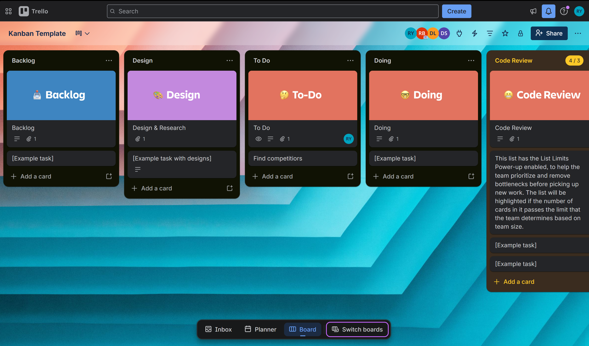

# Adding a member to your Trello board

## Overview

These instructions explain how to invite a teammate to your Trello
board so they can view, edit, and be assigned cards. By the end of
this task, your teammate will have access to your board and be ready
to collaborate.

## Adding a Member to Your Board

1. **Open** your browser and go to [trello.com](https://www.trello.com).
2. **Click** [Log In] and **enter** your credentials.

    At this point, you will land on your Trello home dashboard.

    
    
3. **Click** on the board you want to add a member to.

    At this point, the board will open and you will see all your lists
    and cards.

    

4. **Click** [Share] in the top right corner of the board.

    

5. **Type** your teammate's email address or Trello username in the
   search field.

    !!! info "Info"
        If your teammate has not yet created a Trello account, they
        will receive an email invitation to join Trello and your board
        at the same time.

    

6. **Click** on your teammate's name when it appears in the search
   results.

7. **Click** the role dropdown and **select** [Member].

    At this point, the role will be set to Member by default.

    !!! info "Info"
        Selecting [Admin] gives your teammate full board permissions
        including deleting the board. Select [Member] unless admin
        access is required.

8. **Click** [Send invite].

    At this point, your teammate will receive an email notification
    with a link to join the board.

9. **Click** the X to close the sharing panel.

10. **Click** [Members] in the top bar of the board to confirm your
    teammate has been added.

    At this point, you should see your teammate's profile picture
    appear alongside yours in the board header.

    
 

!!! warning "Warning"
    If your teammate's profile picture does not appear immediately,
    they may not have accepted the invite yet. Ask them to check
    their email inbox including their spam folder.

11. **Click** on your teammate's profile picture to confirm their
    role shows as [Member].

## Conclusion

If you have followed these instructions, you should see your
teammate's profile picture in the board header and their name listed
under [Members].

!!! success "Success"
    Your teammate now has access to the board and can be assigned
    cards. To assign them a card, see
    [How to Create and Assign a Card to a Teammate].
