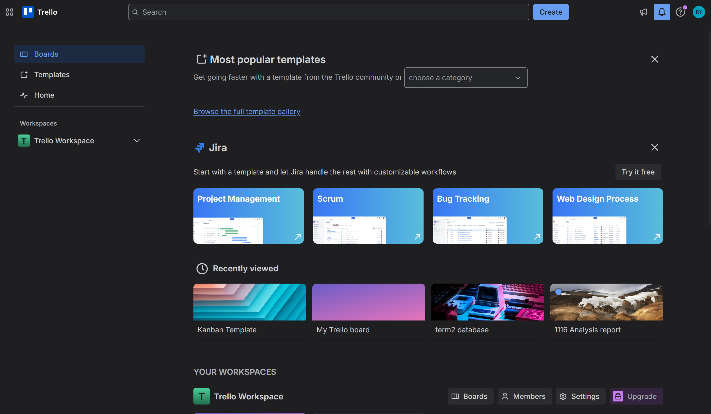
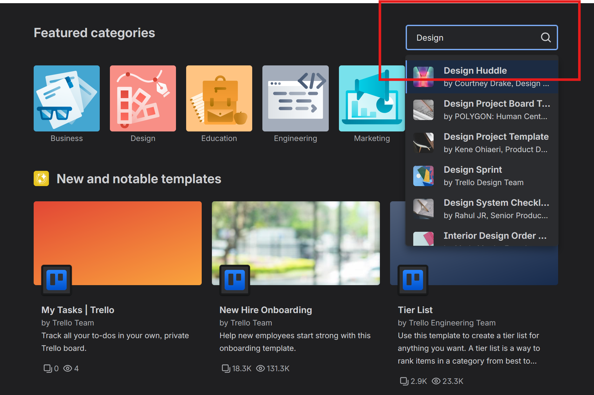
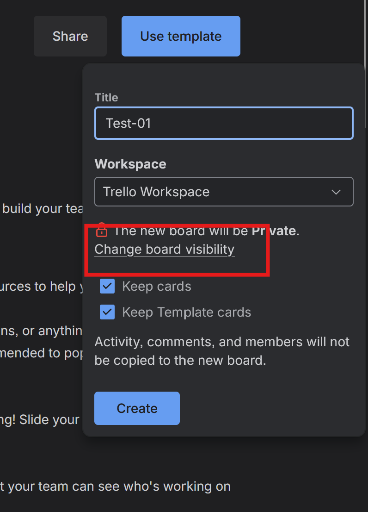

# Creating a Board from a Template in Trello

## Overview

These instructions explain how to create a new Trello board using
a pre-built template. By the end of this task, you will have a
ready-to-use board with lists and structure already set up for you,
saving you the time of building a board from scratch.

These instructions are intended for CST students with no prior
experience using Trello.

!!! info "Info"
    Templates are created by Trello and its community. They come
    with pre-made lists and cards that you can edit or delete to
    fit your project.

---

## Creating a Board from a Template

1. **Open** your browser and go to [trello.com](https://www.trello.com).

2. **Click** [Log In] and **enter** your credentials.

    At this point, you will land on your Trello home dashboard.

    

3. **Click** [Templates] in the top navigation bar.

    At this point, the Trello template gallery will open showing
    a wide variety of templates organized by category.

    

4. **Type** a keyword into the [Search templates] field, for
   example *project management* or *software*.

    !!! info "Info"
        You can also browse by category using the left sidebar.
        Categories include Engineering, Marketing, Education,
        and more.

    

5. **Click** on a template that fits your project to preview it.

    At this point, a preview of the template will appear showing
    its lists and sample cards.

    

6. **Review** the template lists and cards to confirm it suits
   your project needs.

    !!! info "Info"
        You are not locked in to the template structure. All lists
        and cards can be renamed, moved, or deleted after the board
        is created.

7. **Click** [Use template] on the right side of the preview page.

8. **Type** a name for your new board in the [Board title] field.

    !!! warning "Warning"
        Do not leave the board title blank. A board with no name
        will be difficult to identify on your dashboard later.

9. **Click** [Change Visibility] and **select** [Private].

    At this point, the visibility will update to Private.

    

10. **Click** [Keep cards] if you want to keep the sample cards
    from the template, or **click** [Remove cards] to start with
    empty lists only.

    !!! info "Info"
        For a first-time setup, keeping the sample cards is
        recommended as they give useful examples of how to
        structure your tasks.

11. **Click** [Create board].

    At this point, your new board will open with the template
    structure already in place.

12. **Click** on any list name and **type** a new name to
    customize it for your project, then **press** Enter.

13. **Click** [Share] in the top right corner and **invite**
    your teammates to the board.

    At this point, your teammates will receive an email invitation
    to join the board.

    !!! info "Info"
        For instructions on how to invite teammates, see
        [How to Add a Member to Your Board].

---

## Conclusion

If you have followed these instructions, you should see your new
board open with lists and cards already in place from the template
you selected. The board title will appear on your Trello home
dashboard under [Your Workspaces].

!!! success "Success"
    Your board is ready to use. You can now rename lists, delete
    sample cards, and assign tasks to your teammates.
