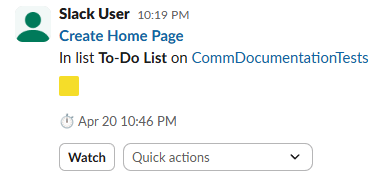

# Integrating Apps

## Overview

This section will teach you how to connect Trello to your [Slack account](https://slack.com/) in order to send cards with tasks to a channel in Slack.

## Add Slack to Trello

1. **Open** your board in Trello.

2. **Click** the :material-power-plug-outline: icon in the top-right menu, then **click** [Add Power-Ups] within the pop-up.

3. Search for Slack using the search bar.

    { height="200" }

4. Once found, **click** on Slack and then **click** [Add].

5. Sign in to your Slack workspace.

6. Authorize Trello to access your Slack account.

!!! success "Success"
    You should now see the word "Slack" and its logo in the top right menu.

    { width="400"}

## Send Cards to Slack

1. **Click** any Trello card.

2. **Click** [Power-ups] on the card.

    !!! warning "Warning"
        If your pop-up looks like the image below after completing step 2, then you must **click** [Link Your Trello Account] and follow those steps before proceeding.

        { width="400"}

3. **Click** Slack, then choose a channel or user.

4. **Click** [Send] to share the card in Slack.

!!! success "Success"
    You should now see a message detailing the Trello card in whatever slack channel or user you sent it to.

    { width="400"}

## Conclusion

If you have followed these instructions, you now have your Trello account linked to Slack and can readily send cards to users or channels.

!!! success "Success"
    You can now send cards of tasks to Slack, allowing for better communication and clarity between you and team members.